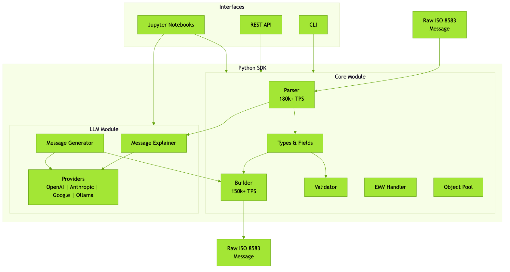
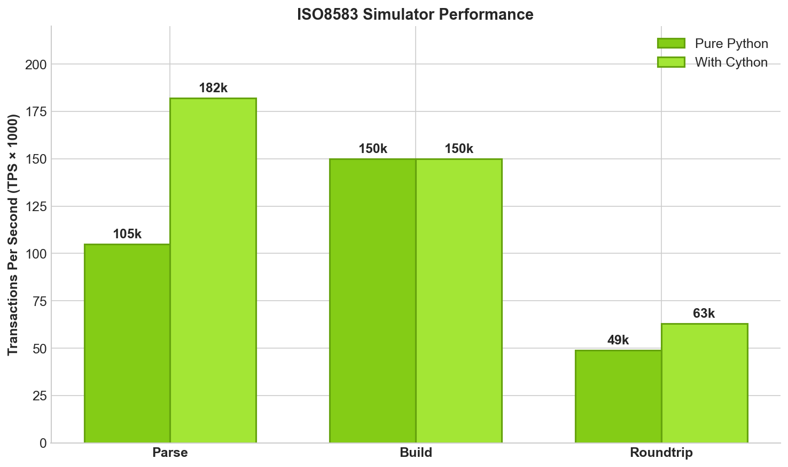

# ISO8583 Simulator

[](https://pypi.org/project/iso8583sim/)
[](https://pypi.org/project/iso8583sim/)
[](https://github.com/bassrehab/ISO8583-Simulator/blob/main/LICENSE)
[](https://github.com/bassrehab/ISO8583-Simulator/actions/workflows/ci.yml)
[](https://iso8583sim.com)
[](https://github.com/astral-sh/ruff)

A modern, high-performance ISO 8583 message simulator with CLI, Python SDK, and AI-powered message explanation and generation.

## Features

- **Message Handling**:
  - Parse ISO 8583 messages (180k+ TPS with Cython)
  - Build ISO 8583 messages (150k+ TPS)
  - Validate message structure and content
  - Support for ISO versions (1987, 1993, 2003)

- **Network Support**:
  - VISA, Mastercard, AMEX, Discover, JCB, UnionPay
  - Network-specific field validation
  - EMV/chip card data handling (Field 55)
  - PIN blocks (ISO 9564 formats 0, 1, 3, 4) and MACs for fields 64 and 128
  - Conversion between the 1987, 1993 and 2003 versions
  - Binary wire formats: binary bitmaps, packed BCD, EBCDIC

- **Network Simulation**:
  - `iso8583sim serve`: mock issuer host that approves, declines, delays or drops requests by rules
  - `iso8583sim send` and `iso8583sim load`: send messages over TCP and measure throughput and latency
  - Length headers and TPDUs for real host links

- **Multiple Interfaces**:
  - Command Line Interface (CLI)
  - Python SDK for programmatic usage
  - REST API (`pip install iso8583sim[web]`, then `iso8583sim web`)
  - Interactive Jupyter notebooks

- **AI-Powered Features**:
  - Explain ISO 8583 messages in plain English using LLMs
  - Generate messages from natural language descriptions
  - Supports OpenAI, Anthropic, Google, and Ollama (local/offline)
  - MCP server so Claude, Cursor and other AI assistants can parse, build and validate messages

- **Performance Optimized**:
  - Compiled Cython extensions for 2x speedup, included in the PyPI wheels
  - Object pooling for high-throughput scenarios
  - See [Performance Guide](https://iso8583sim.com/docs/performance)

## Architecture



## Installation

```bash
pip install iso8583sim
```

Wheels for Linux, macOS and Windows include the compiled Cython extensions (about 2x faster parsing), so nothing else is needed. On other platforms pip builds from source: with a C compiler you get the extensions, without one it falls back to pure Python.

## Quick Start

### Python SDK

```python
from iso8583sim.core.parser import ISO8583Parser
from iso8583sim.core.builder import ISO8583Builder
from iso8583sim.core.validator import ISO8583Validator
from iso8583sim.core.types import ISO8583Message

# Build a message
builder = ISO8583Builder()
message = ISO8583Message(
    mti="0100",
    fields={
        0: "0100",
        2: "4111111111111111",
        3: "000000",
        4: "000000001000",
        11: "123456",
        41: "TERM0001",
        42: "MERCHANT123456 ",
    }
)
raw = builder.build(message)

# Parse a message
parser = ISO8583Parser()
parsed = parser.parse(raw)

# Validate a message
validator = ISO8583Validator()
errors = validator.validate_message(parsed)
```

### CLI Usage

```bash
# Parse a message
iso8583sim parse "0100..." --version 1987

# Build a message
iso8583sim build --mti 0100 --fields fields.json

# Validate a message
iso8583sim validate "0100..."

# Generate sample messages
iso8583sim generate --type auth --pan 4111111111111111 --amount 1000

# Explain a message (LLM, or --no-llm for an offline summary)
iso8583sim explain "0100..."

# Generate a message from a description
iso8583sim generate --llm "$50 refund to a Mastercard at ACME Store"
```

## AI-Powered Features

Use LLMs to understand, explain, and generate ISO 8583 messages.

### Explain Messages in Plain English

```python
from iso8583sim.llm import MessageExplainer

explainer = MessageExplainer()  # Auto-detects available provider
explanation = explainer.explain(message)
```

> This is a $100.00 VISA purchase authorization request at a gas station.
> The card expires December 2026 and was read via chip (EMV).
> Expected response: MTI 0110 with response code 00 (approved) or 51 (insufficient funds).

### Generate Messages from Natural Language

```python
from iso8583sim.llm import MessageGenerator

generator = MessageGenerator()
message = generator.generate("$50 refund to Mastercard at ACME Store")
# Returns a fully-formed ISO8583Message ready to use
```

### Supported Providers

| Provider | Type | Installation |
|----------|------|--------------|
| OpenAI (GPT-4o) | Cloud | `pip install iso8583sim[openai]` |
| Anthropic (Claude) | Cloud | `pip install iso8583sim[anthropic]` |
| Google (Gemini) | Cloud | `pip install iso8583sim[google]` |
| Ollama (Llama, Qwen, Mistral) | Local | `pip install iso8583sim[ollama]` |

Ollama runs completely offline with no API keys needed.

See the [OpenAI notebook](notebooks/07_llm_features.ipynb) or [Ollama notebook](notebooks/08_llm_features_ollama.ipynb) for complete examples.

### MCP Server for AI Assistants

Give Claude, Cursor or any MCP client direct access to the parser, builder and validator:

```bash
pip install iso8583sim[mcp]

# Claude Code
claude mcp add iso8583sim -- iso8583sim mcp
```

For Claude Desktop or Cursor, add this to the client's MCP config:

```json
{
  "mcpServers": {
    "iso8583sim": { "command": "iso8583sim", "args": ["mcp"] }
  }
}
```

Then ask things like *"Why was this transaction declined?"* or *"Generate a Mastercard auth and the matching approval."* The server provides 18 tools, including parse, build, validate, explain, EMV decoding, test message generation, responses, reversals, message diffs, version conversion, network rule checks, PIN blocks, MACs and sending to a (local, allowlisted) host. It runs locally and needs no LLM API key. See the [MCP docs](https://iso8583sim.com/docs/mcp-server) for all tools, resources and prompts.

## Interactive Notebooks

Learn ISO 8583 with our Jupyter notebooks:

| Notebook | Description |
|----------|-------------|
| [01_getting_started.ipynb](notebooks/01_getting_started.ipynb) | Basic concepts and quick start |
| [02_parsing_messages.ipynb](notebooks/02_parsing_messages.ipynb) | Deep dive into message parsing |
| [03_building_messages.ipynb](notebooks/03_building_messages.ipynb) | Building various message types |
| [04_network_specifics.ipynb](notebooks/04_network_specifics.ipynb) | VISA, Mastercard, and other networks |
| [05_emv_data.ipynb](notebooks/05_emv_data.ipynb) | Working with EMV/chip card data |
| [06_benchmarking.ipynb](notebooks/06_benchmarking.ipynb) | Performance testing and benchmarks |
| [07_llm_features.ipynb](notebooks/07_llm_features.ipynb) | AI-powered message explanation and generation (OpenAI) |
| [08_llm_features_ollama.ipynb](notebooks/08_llm_features_ollama.ipynb) | AI-powered features with local Ollama (offline, private) |

Run locally:
```bash
pip install jupyter
jupyter notebook notebooks/
```

## Performance

Benchmarks on Apple Silicon (M-series), Python 3.12:

| Operation | Pure Python | With Cython |
|-----------|-------------|-------------|
| Parse | ~105k TPS | ~182k TPS |
| Build | ~150k TPS | ~150k TPS |
| Roundtrip | ~49k TPS | ~63k TPS |



See [benchmarks/BASELINE.md](benchmarks/BASELINE.md) for detailed results.

## Documentation

Full documentation is available at **[iso8583sim.com](https://iso8583sim.com)**

- [Getting Started](https://iso8583sim.com/docs/getting-started/quickstart/) - Quick start guide
- [Architecture](https://iso8583sim.com/docs/architecture/overview/) - System design and decisions
- [API Reference](https://iso8583sim.com/docs/api/core/) - Complete API documentation
- [Performance Guide](https://iso8583sim.com/docs/performance/) - Optimization techniques

## Development

```bash
# Clone and setup
git clone https://github.com/bassrehab/ISO8583-Simulator.git
cd iso8583sim
python -m venv .venv
source .venv/bin/activate
pip install -e ".[dev]"

# Run tests
pytest

# Run benchmarks
python benchmarks/bench_parser.py
python benchmarks/bench_roundtrip.py
```

## Contributing

1. Fork the repository
2. Create your feature branch (`git checkout -b feature/my-feature`)
3. Commit your changes (`git commit -am 'Add new feature'`)
4. Push to the branch (`git push origin feature/my-feature`)
5. Create a Pull Request

## Author

**Subhadip Mitra** - [subhadipmitra.com](https://subhadipmitra.com)

- GitHub: [@bassrehab](https://github.com/bassrehab)
- LinkedIn: [subhadipmitra](https://linkedin.com/in/subhadip-mitra)

## License

MIT License - see [LICENSE](LICENSE) for details.
